# Inno Agent 知识管理使用手册

> 适用范围：Inno Agent Web UI 的 **笔记本 / L2 Wiki 知识库**<br>
> 更新日期：2026-07-21

本文介绍如何使用 Inno Agent 的知识管理部分，将学习资料、个人笔记和对话结论沉淀到 L2 Wiki 知识库，并通过知识图谱进行浏览、检索和复用。

知识管理的核心流程是：

```text
新建笔记 / 上传文件 / 在笔记中录音
              ↓
       在“资料”中检查与整理
              ↓
          归档到 Wiki
              ↓
  生成资料摘要、概念、实体和关联关系
              ↓
  勾选若干资料，进行总结、对比或提炼
              ↓
     在“知识”或后续对话中复用
```

需要特别注意：草稿不会自动进入 Wiki 或知识图谱；**保存** 只保存当前编辑内容，**归档到 Wiki** 才会生成长期知识；修改已归档的原始笔记后，需要 **重新归档** 才能同步 Wiki。

---

## 一、功能入口

打开 Inno Agent Web UI 后，在右侧工作区面板中进入 **笔记本** 标签页。左侧列表顶部使用下拉框切换两个视图，切换时列表宽度保持不变：

| 视图 | 页面名称 | 主要用途 |
|---|---|---|
| 资料 | 资料 / 草稿 / 已归档 | 上传文件、新建笔记、编辑资料、归档或重新归档到 Wiki |
| 知识 | Wiki / 图谱 / 页面 | 浏览已归档知识、查看图谱、按类型搜索和筛选 |

下拉框位于搜索栏上方。选择 **资料** 后显示草稿、已归档资料和模板入口；选择 **知识** 后显示 Wiki 页面、图谱和页面阅读区。

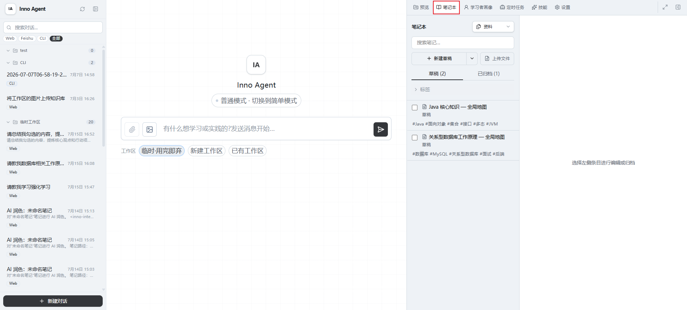

### 1.1 五分钟快速上手

1. 进入 **笔记本 → 资料**，点击 **新建草稿**。
2. 填写标题和正文，展开 **笔记属性** 补充记录日期和 2～5 个标签。
3. 等待底部显示 **已保存**（也可点击 **保存** 立即保存），再点击 **归档到 Wiki**。
4. 归档完成后点击 **查看 Wiki 摘要**，检查生成内容。
5. 在资料列表中勾选若干笔记，点击 **在对话中总结**，让 Agent 汇总或比较所选内容。
6. 切换到 **图谱** 查看关联，或继续在聊天区生成复习材料。

---

## 二、资料视图：管理待归档内容

**资料** 视图用于收集和整理原始材料。这里的内容可以是手写 Markdown 笔记，也可以是上传的 PDF、图片、Word、文本等文件。

### 2.1 新建草稿

1. 进入 **笔记本 → 资料**。
2. 点击左侧工具栏中的 **新建草稿**。
3. 在右侧编辑区填写标题、标签和正文。
4. 等待自动保存完成，或点击 **保存**，草稿会保留在 **草稿** 列表中。

草稿只是原始资料，不会自动进入知识图谱。只有点击 **归档到 Wiki** 后，系统才会生成 Wiki 摘要和关联概念。

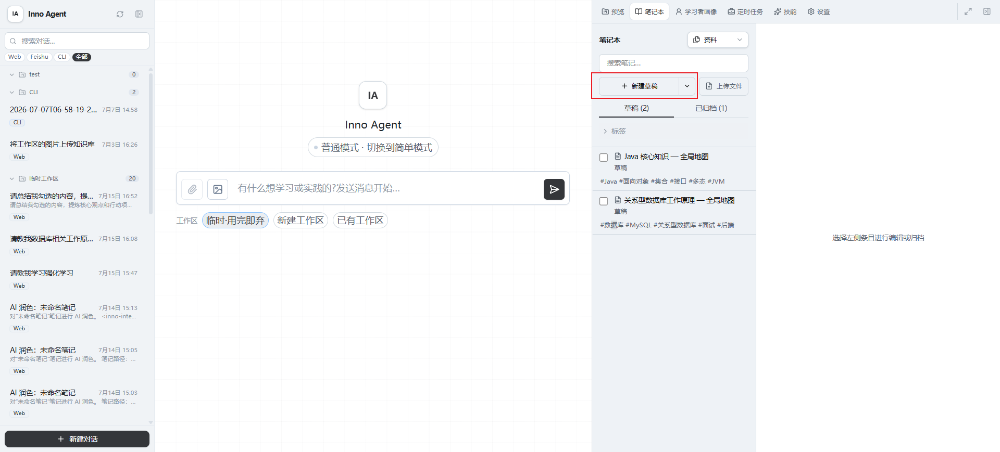

### 2.2 从模板创建笔记

在 **新建草稿** 右侧点击下拉按钮，再从 **从模板创建** 区域选择模板。它适合会议纪要、读书笔记、学习复盘等有固定结构的内容。菜单会根据实际可用内容显示以下分组：

- **我的模板**：自己创建或从内置模板复制得到的模板；尚未创建个人模板时不会显示这一组。
- **内置模板**：随应用提供的只读模板，例如读书笔记、会议纪要、技术调研、每日笔记、学习笔记和周报。

每个模板项会同时显示名称和用途说明，右侧的 **内置** 标识表示该模板只读。菜单底部固定提供 **新建自定义模板** 和 **管理模板** 两个入口。

选择模板后，系统会使用模板名称作为笔记标题，并写入模板的默认标签和 Markdown 正文结构。创建后的草稿与普通笔记相同，可以自由修改、保存和归档。

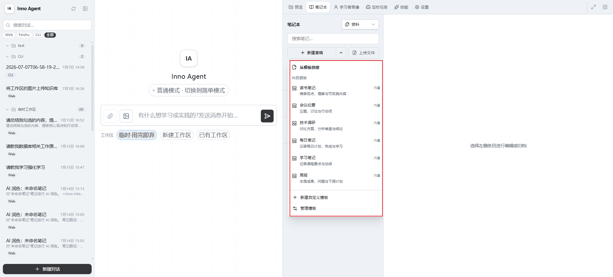

#### 2.2.1 新建自定义模板

1. 点击 **新建草稿** 右侧的下拉按钮。
2. 在菜单底部选择 **新建自定义模板**。
3. 填写模板名称、描述和默认标签。
4. 在 **Markdown 正文** 中编写新笔记的初始结构。
5. 使用 **编辑 / 预览** 检查正文效果。
6. 点击 **创建**。

模板至少需要名称和非空 Markdown 正文。系统会自动生成内部标识，用户不需要填写或维护模板 ID、英文名称和默认标题。新建笔记时，模板名称会作为初始标题。

Markdown 模板示例：

```markdown
# 项目复盘

## 目标

-

## 实际结果

-

## 问题与原因

-

## 下一步行动

-
```

自定义模板保存在本机运行数据目录中，重启应用后仍然可用，不需要重新构建前端。

#### 2.2.2 管理模板

在模板菜单底部点击 **管理模板**，左侧会切换为模板列表，右侧显示模板详情或编辑器。模板管理和资料列表使用相同的固定栏宽，切换时页面不会横向跳动。左侧可以搜索模板，并按 **我的模板**、**内置模板** 分组查看；尚未创建自定义模板时，**我的模板** 分组为空。

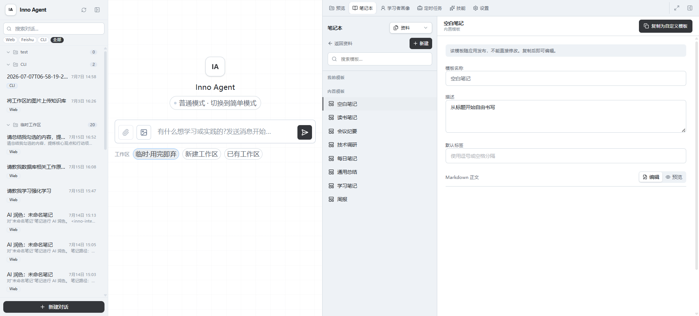

可以执行以下操作：

| 操作 | 内置模板 | 自定义模板 |
|---|---:|---:|
| 查看和预览 | 支持 | 支持 |
| 直接编辑 | 不支持 | 支持 |
| 复制为自定义模板 | 支持 | 支持 |
| 删除 | 不支持 | 支持 |

内置模板不能直接修改。选择内置模板时，右侧会显示只读提示，字段和 Markdown 正文仅供查看；点击右上角 **复制为自定义模板**，系统会创建一个可编辑副本并自动生成内部标识。

编辑自定义模板后点击 **保存**。如果有未保存的真实修改，返回资料时系统会要求确认；如果只是打开和查看模板，不会出现保存提示。

自定义模板保存后会始终显示在 **从模板创建 → 我的模板** 中，并参与 AI 润色的模板匹配。若某个模板不再需要，可以在管理界面将其删除。

### 2.3 搜索和按标签筛选资料

资料列表顶部的搜索框支持按标题、原始路径和标签查找当前列表中的内容。搜索框下方可以展开标签区域；点击一个标签后，只显示带有该标签的草稿或已归档资料，再次点击当前标签旁的关闭图标可以清除筛选。

标签筛选只作用于当前的 **草稿** 或 **已归档** 列表。切换列表后，系统会按新列表重新统计常用标签。编辑笔记标签时，输入框也会根据已有标签提供建议，便于统一写法。

### 2.4 编辑笔记属性

在编辑器上方展开 **笔记属性**，可以维护标题、记录日期和标签：

| 属性 | 用途 | 建议 |
|---|---|---|
| `title` | 标识笔记主题 | 使用“对象 + 主题”，例如“React Hooks 闭包陷阱” |
| `recordDate` | 内容发生或记录日期 | 会议、复盘、日记建议填写 |
| `tags` | 分类、筛选和检索 | 使用 2～5 个稳定短标签，按 Enter、空格或逗号确认 |

标题、记录日期、标签或正文发生变化后，系统会在短暂停顿后自动保存，并在编辑区底部显示 **未保存**、**保存中**、**已保存** 或 **保存失败**。也可以点击 **保存**，或使用 `Ctrl+S`（macOS 为 `Cmd+S`）立即保存。切换笔记、打开版本历史或开始录音前，系统会先尝试保存当前修改。

标签应统一写法，例如只使用 `React`，不要同时使用 `reactjs` 和 `React.js`。

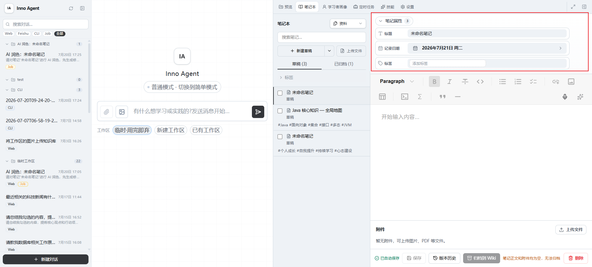

### 2.5 使用 AI 润色

Markdown 编辑器工具栏最右侧的星光图标是 **AI 润色**。它可以整理标题、段落和清单，并根据内容推荐标签或应用合适的模板结构。AI 可以读取当前可见的内置模板和自定义模板。

AI 润色选择模板时遵循以下规则：

1. 排除空白模板。
2. 如果笔记内容明显符合某个模板，优先按该模板的章节和组织方式润色。
3. 如果没有明确匹配，使用通用、清晰的 Markdown 结构，不会强行套用模板。
4. 在对话中明确指定模板名称时，Agent 会优先采用该模板。

如果需要确保使用某个自定义模板，可以在聊天区明确说明：

```text
请使用“项目复盘”模板润色当前笔记，保留所有事实、数字和行动项。
```

点击星光图标后，系统会在对话区分析当前笔记适合的模板。匹配明确时直接生成建议；匹配不明确时，会要求你选择模板或不使用固定模板。生成完成后，笔记区显示逐行 Diff：绿色表示新增，红色表示删除，同时列出采用的模板和推荐标签。

在 Diff 中点击 **应用修改** 后，建议内容和推荐标签才会写入编辑器；点击 **放弃修改** 则保留原文。应用前原笔记不会改变。应用后请检查事实、数字、专有名词、日期和待办负责人，系统会自动保存，也可以点击 **保存** 立即保存。

AI 润色不会自动归档。对已归档笔记应用润色后，资料会变为 **待更新**，需要点击 **重新归档** 才会同步 Wiki。会议纪要仍使用原有会议纪要结构。

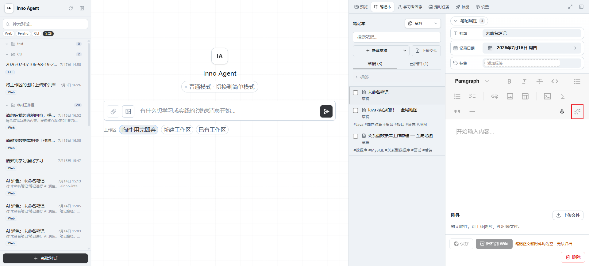

### 2.6 添加笔记附件

Markdown 笔记底部提供 **附件** 区域，可以上传多个补充文件，并查看文件名、大小和上传日期。附件支持下载和删除。

附件与正文是不同对象：上传附件不会自动把附件内容写入可见正文，也不会单独触发归档。点击 **归档到 Wiki** 时，系统会解析附件，并把提取内容与正文一起用于生成摘要和关联知识；Wiki 摘要会保留附件来源链接。正文为空但至少有一个可解析附件时仍可归档。

附件解析支持 PDF、DOCX、XLSX、PPTX、PNG、JPG/JPEG、GIF、WebP、TIFF/TIF，以及常见纯文本格式。如果任一附件格式不受支持、内容为空或解析失败，本次笔记归档会失败，并标出对应附件。修复或删除问题附件后可以重新归档。需要让 Agent 在普通对话中直接使用附件时，应明确说明文件和用途。

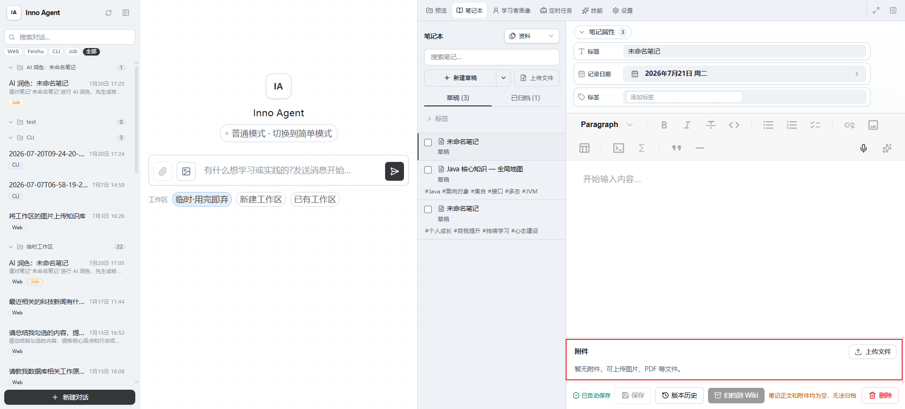

### 2.7 查看和恢复版本历史

Markdown 笔记会保留版本历史，便于查看过去的内容或撤销误改。打开一篇笔记后，点击编辑区顶部的 **版本历史**，系统会先保存当前未保存的修改，再打开历史记录窗口。

窗口左侧按时间从新到旧列出版本，并标明版本来源和正文长度；右侧显示所选版本的标题、标签和正文。版本来源包括：

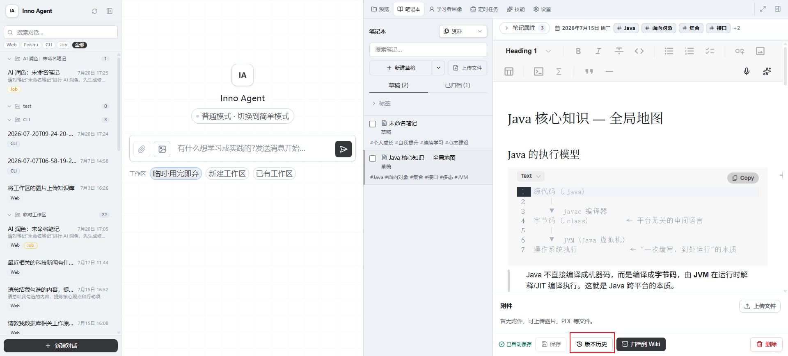

| 版本来源 | 产生时机 |
|---|---|
| 创建 | 新建笔记时保存的初始内容 |
| 自动保存 | 编辑过程中由系统自动保存 |
| 手动保存 | 点击 **保存** 时记录 |
| 版本恢复 | 恢复历史版本后记录的新版本 |

恢复历史版本的步骤：

1. 打开目标 Markdown 笔记，点击 **版本历史**。
2. 在左侧选择时间和来源合适的版本，在右侧核对标题、标签和正文。
3. 点击 **恢复此版本**，并在确认窗口中再次确认。
4. 返回编辑区检查恢复结果；如果该笔记已经归档，状态会变为 **待更新**，请重新归档以同步 Wiki。

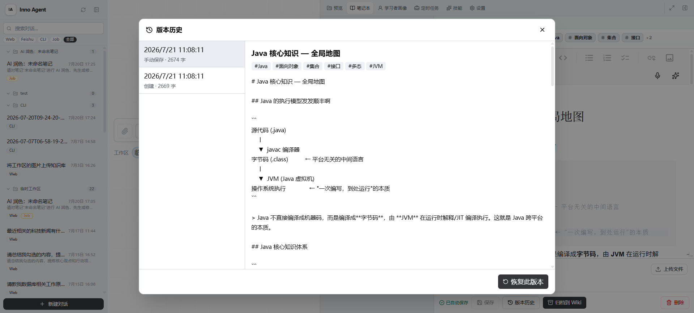

恢复操作不会直接丢弃当前内容。系统会先把恢复前的当前内容写入版本历史，再用所选版本替换笔记的标题、标签、记录日期和正文，因此仍可通过版本历史找回恢复前的内容。

需要注意：

- 版本历史仅适用于 Markdown 笔记，不适用于 PDF、Word、图片等上传文件。
- 已归档笔记也可以直接恢复历史版本；恢复后原 Wiki 暂不改变，资料会变为 **待更新**。
- 内容没有变化时不会重复生成版本；连续自动保存会在短时间内合并，避免产生过多相近记录。
- 每篇笔记最多保留最近 100 个版本，超过后会自动移除最早的版本。
- 删除原始笔记时，其版本历史也会一并删除；需要长期保留时，请不要用删除代替撤回归档。

### 2.8 上传文件

文件可以通过两种方式进入知识管理流程：在 **资料** 视图中手动上传，或先上传到工作区后通过 AI 交互归档。

#### 方式 A：在资料视图上传

1. 在 **资料** 视图左侧点击上传按钮。
2. 选择需要上传的文件。
3. 上传后文件会出现在 **草稿** 列表中，状态通常为 **待归档** 或 **已提取**。
4. 在右侧预览文件内容，确认无误后点击 **归档到 Wiki**。

PDF 和图片会在右侧预览区显示原文件；文本类文件会显示可阅读内容。对于无法直接预览的二进制文件，可以先下载查看，再决定是否归档。

资料视图当前适合直接归档 PDF、DOCX、PNG、JPG/JPEG、GIF、WebP、TIFF、纯文本和 Markdown。需要文档解析的单个文件最大为 100 MB，实际能否归档还取决于文件是否损坏、是否能提取到有效正文以及运行环境中的解析依赖。XLSX、PPTX、TIF、旧版 DOC 或其他二进制格式建议作为笔记附件使用，或先转换为 DOCX、PDF、Markdown 或图片。

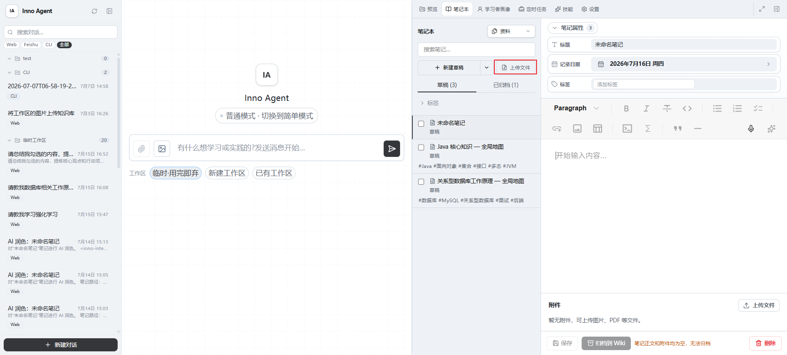

#### 方式 B：通过 AI 交互归档工作区文件

也可以先把文件上传到工作区，再通过对话要求 Agent 读取并归档。适合边讨论、边分析、边决定是否进入知识库的场景。

操作步骤：

1. 在右侧 **工作区** 面板中上传文件，或把文件拖入当前工作区。
2. 确认文件已经出现在工作区文件列表中，例如 `uploads/react-hooks-closure.pdf`。
3. 回到聊天区，用自然语言告诉 Agent 要处理哪个文件。
4. 要求 Agent 先分析文件内容，再按你的标题和标签归档到 Wiki。

示例指令：

```text
我已经把 XXXX PDF 上传到工作区。请先总结主要内容，再把它归档到 Wiki。
```

通过这种方式，文件先作为工作区资料存在；当你明确要求归档时，Agent 会读取该文件，将内容整理为 Wiki 摘要，并生成相应的概念和图谱关联。

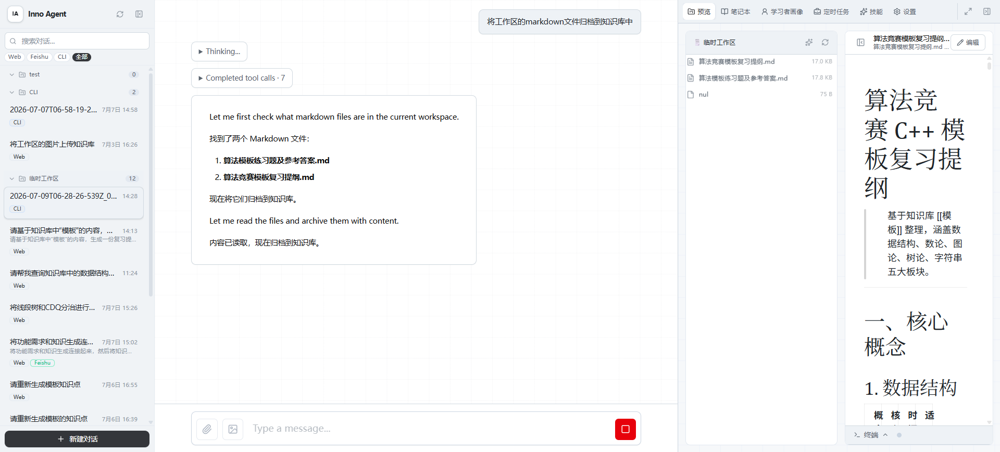

### 2.9 会议录音和音频导入

实时录音和导入已有音频都会生成可检查的会议内容，但写入位置不同：实时录音追加到当前 Markdown 笔记，导入音频则创建新的会议纪要草稿。

**实时录音：**

1. 新建或打开一篇 Markdown 笔记。没有选中可编辑笔记时，麦克风按钮不可用。
2. 点击编辑器工具栏中的麦克风图标，选择输入设备，再点击 **开始录音**。系统会先保存当前未保存的修改。
3. 录音内容会追加到当前笔记的 **录音记录：笔记标题** 章节，不会新建另一篇笔记。录音时可以暂停、继续或结束，并可观察录音时长、音量和处理状态。
4. 录音过程中，该章节会持续更新转写内容；结束录音后等待会议纪要生成，再检查正文。
5. 如果当前笔记已经归档，写入录音后资料会变为 **待更新**，需要重新归档才能同步 Wiki。

同一篇笔记不能同时进行多个录音。删除正在录音的笔记会立即停止本次录音；页面关闭或连接中断时，系统会暂停并尝试恢复，超过恢复时间则将录音标记为中断。

**导入已有录音：**

点击普通上传图标并选择 WAV、MP3、M4A、WebM、OGG、MP4、AAC 或 FLAC 文件。系统会创建一篇以文件名为标题、带有 **会议纪要** 标签的新草稿，然后自动进入音频转换、转写和纪要生成流程，并显示处理进度。导入音频依赖 FFmpeg；容器镜像已包含，源码或桌面环境需要确保 `ffmpeg` 位于 PATH。

会议完成且音频仍可用时，可以点击 **重新转写**。系统会保留旧转写版本，再生成新的转写和纪要。

使用前请在设置中正确配置会议转写服务，并在录制他人发言前取得必要同意。使用云端转写服务时，音频会发送给相应服务商处理。

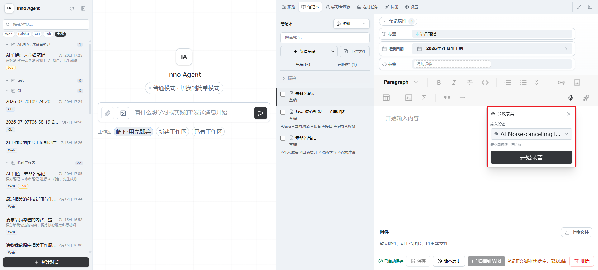

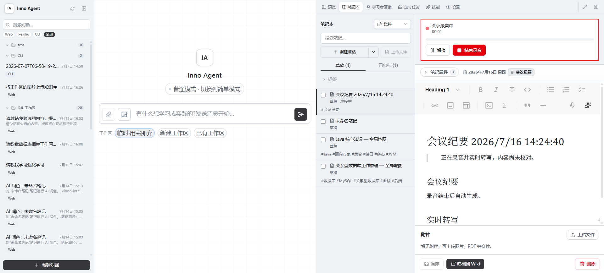

### 2.10 选择多篇笔记进行知识二次加工

知识二次加工是指勾选若干篇已有笔记或资料，让 Agent 一次读取这些内容，再按你的要求进行总结、对比、归纳、提炼或重组。它适合把分散记录整理成阶段总结、主题综述、行动清单、复习提纲等新成果。

#### 操作步骤

1. 进入 **笔记本 → 资料**。
2. 在资料列表中，点击每篇资料左侧的复选框；最多可以选择 20 篇。
3. 列表底部会显示 **已选择 N / 20 篇**。检查数量后，点击 **在对话中总结**。
4. 聊天输入框会获得默认指令，并在上方显示 **正在引用 N 篇笔记**；可以删除单篇引用，也可以点击 **清除全部** 重新选择。
5. 根据目标修改默认指令，然后发送。Agent 会读取全部已选择内容，再返回加工结果。

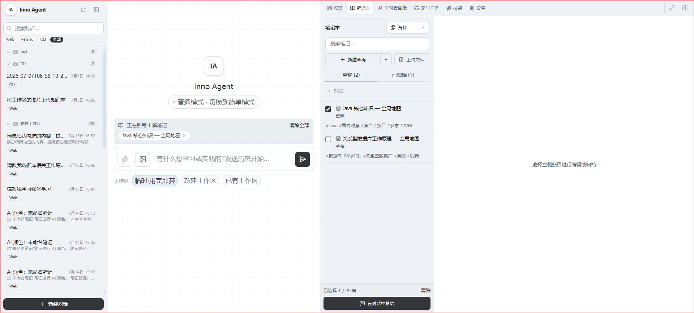

默认指令为：

```text
请总结我勾选的内容，提炼核心观点和行动项，并标明信息来源。
```

可以把它改成更具体的任务，例如：

```text
请比较这几篇学习笔记，按“共同结论、不同观点、证据、待验证问题”整理，并在每条内容后标明来源笔记。
```

```text
请把选中的会议记录合并成一份项目阶段总结，提取已经完成的事项、未解决问题、负责人和下一步行动。
```

```text
请基于选中的课程笔记生成复习提纲和 10 道练习题；不要加入笔记之外的知识，信息不足时明确说明。
```

#### 可进行的加工

| 加工目标 | 示例输出 |
|---|---|
| 汇总 | 多篇笔记的核心观点、关键事实和结论 |
| 对比 | 共同点、差异、冲突观点及各自来源 |
| 提炼 | 行动项、决策、术语、方法、风险或待验证问题 |
| 重组 | 按主题、时间线、项目阶段或知识结构重新编排 |
| 学习加工 | 复习提纲、知识卡片、练习题和查漏补缺清单 |

Markdown 笔记可以直接勾选；PDF、Word 和图片等文件需要先完成内容提取，无法引用时复选框会禁用并提示先归档、提取。资料很长或选择数量较多时，系统可能截取部分正文，因此重要数字、结论和来源仍需人工复核。

二次加工的结果默认出现在当前对话中，不会自动修改原笔记，也不会自动进入 Wiki。如果希望长期保存，可以继续要求 Agent：

```text
请把上面的总结保存为一篇新笔记，标题为“项目阶段总结”，标签使用 项目复盘、阶段总结；先不要归档。
```

检查新笔记后，再由你决定是否归档到 Wiki。这样可以保留原始资料，同时把跨笔记加工得到的新成果作为独立资料管理。

---

## 三、归档到 Wiki

点击 **归档到 Wiki** 后，Inno Agent 会把当前资料转换为可长期复用的知识：

1. 保存原始资料，作为可追溯来源。
2. 提取正文或文件内容。
3. 生成一篇资料摘要页。
4. 自动识别相关概念、实体、分析主题和标签。
5. 将页面和关联关系加入知识图谱。

归档完成后，资料会移动到 **已归档** 列表，并出现 **查看 Wiki 摘要** 按钮。点击后会切换到 **知识** 视图，打开对应的 Wiki 页面。

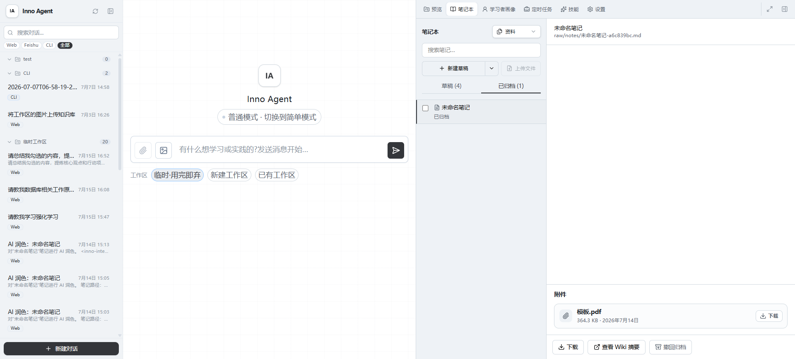

### 归档后的状态

| 状态 | 含义 | 建议操作 |
|---|---|---|
| 已归档 | 内容已进入 Wiki 和知识图谱 | 可直接查看或继续提问 |
| 待更新 | 原始笔记已修改，但 Wiki 摘要还未同步 | 点击 **重新归档** |
| 失败 | 上传、解析或生成失败 | 检查文件内容后重试 |

正文为空且没有附件的笔记不能归档。归档可能调用当前文本模型；处理期间按钮会变为 **停止归档**，可以中止正在处理或排队等待的任务。停止归档不会删除原始资料；停止后请刷新资料和图谱确认状态，需要时可以重新归档。

归档后建议检查摘要是否覆盖原文、数字和专有名词是否正确、关联概念是否合理，以及是否存在待确认或低置信度内容。

### 3.1 重新归档、撤回归档和删除

- **直接修改并重新归档**：已归档的 Markdown 笔记和 Markdown 文件仍可编辑。保存修改、恢复历史版本、应用 AI 润色或写入录音后，资料会变为 **待更新**；点击 **重新归档** 可刷新 Wiki 摘要和关联知识，并保留原始资料身份。
- **撤回归档**：删除该资料生成的 Wiki 摘要和仅由它提取的知识点，原始笔记或文件退回草稿区。
- **删除草稿**：永久删除尚未归档的原始条目，操作不可撤回。
- **删除 Wiki 页面**：永久删除所选知识页面并更新相关索引，和撤回整条资料归档不同。

如果只是修改原始 Markdown 内容，直接编辑并 **重新归档** 即可。只有希望将资料退出知识库、重新回到草稿流程时才使用 **撤回归档**；不要通过删除多个 Wiki 页面代替撤回归档。

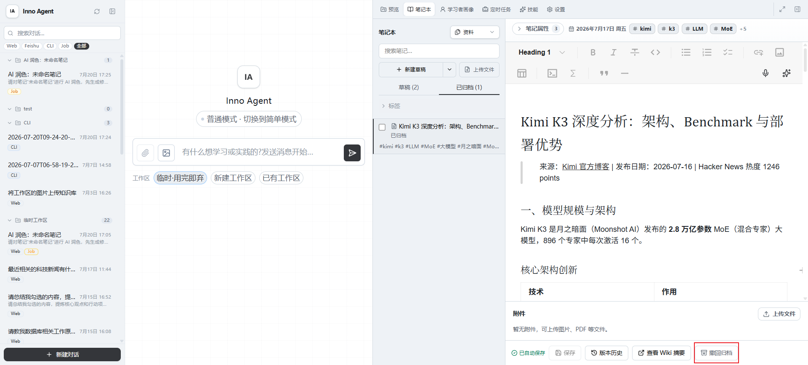

---

## 四、知识视图：浏览 Wiki 和图谱

切换到 **知识** 视图后，可以查看已经沉淀到 L2 Wiki 的知识页面。左侧是页面列表和筛选区，右侧是图谱或页面内容。

### 4.1 搜索和筛选

左侧搜索框支持按页面标题、标签或正文预览搜索。类型筛选包括：

| 类型 | 含义 |
|---|---|
| 资料 | 由文件或笔记归档生成的主摘要页 |
| 实体 | 人物、组织、项目、产品、技术名词等实体 |
| 概念 | 可复用的知识点、方法、定义或原理 |
| 分析 | 由资料延展出的判断、比较或总结 |


### 4.2 图谱视图

点击右侧顶部的 **图谱图标** 可以查看知识之间的连接关系。图谱中的节点代表资料、概念、实体、分析或标签，边代表页面之间的引用和关联。图谱工具栏使用图标按钮；将鼠标悬停在按钮上可确认其名称。

常用操作：

1. 单击资料、实体、概念或分析节点：直接打开对应 Wiki 页面。
2. 单击标签节点：选中该标签并查看顶部提示；标签没有独立 Wiki 页面。
3. 点击 **自适应**：让图谱自动缩放到合适范围。
4. 点击 **重新布局**：重新计算当前可见节点的位置。
5. 点击 **刷新图谱**：重新加载最新知识关系。
6. 使用类型按钮：显示或隐藏资料、实体、概念、分析和标签节点。标签节点默认隐藏。
7. 使用鼠标滚轮缩放，拖动画布移动视图；右上角按钮可以折叠或展开左侧页面列表。

大型图谱建议先隐藏暂时不关注的类型，再点击 **重新布局**。

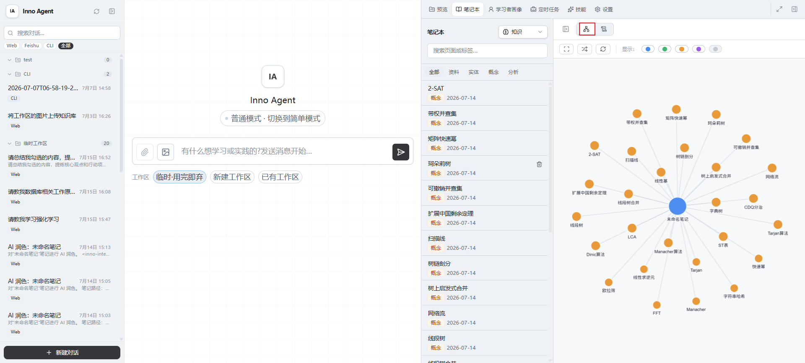

### 4.3 页面视图

点击右侧顶部的 **页面图标** 可以阅读当前选中的 Wiki 页面。资料摘要页通常包含：

- 概览：这份资料讲了什么。
- 关键结论：值得长期保留的结论。
- 推导过程：重要背景、判断依据和取舍。
- 关联概念 / 实体：可进入图谱继续浏览的知识节点。
- 来源：指向原始笔记或文件。
- 待确认事项：不确定、需复核或 OCR 可能有误的内容。

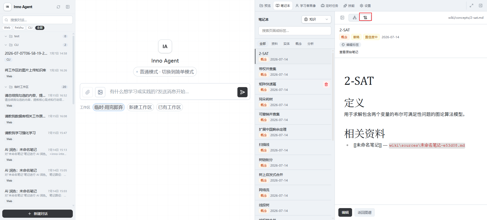

### 4.4 编辑和维护 Wiki 页面

- 点击页面底部 **编辑**，可以修正 Wiki 正文；保存前不要删除必要的来源信息。
- 点击页面顶部的标签入口，可以添加或删除标签。空格、逗号等均可用于确认标签，重复标签会被合并。
- 资料摘要页提供 **重新生成**。它会根据原始来源重新生成摘要；如果页面已有较多手工修改，操作前应确认是否需要保留。
- 点击 **查看原始笔记** 可以返回资料区，对照原始来源。
- 页面列表中的删除按钮会永久删除所选 Wiki 页面，请谨慎操作。

如果只是摘要存在小错误，可以直接编辑 Wiki；如果原始资料本身已经变化，应回到资料区修改并 **重新归档**。

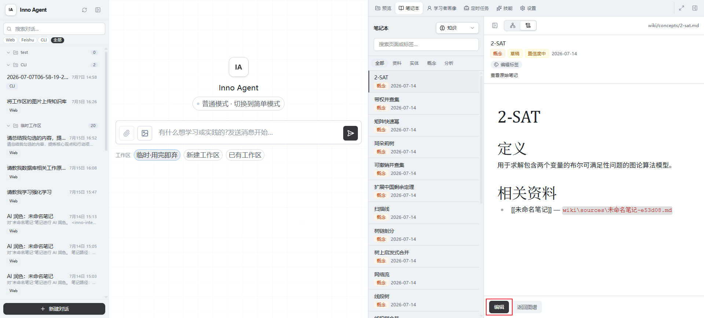

---

## 五、在对话和工作区中复用知识

### 5.1 查询并使用已归档知识

归档后的知识可以在后续对话中被 Agent 检索和引用。你可以直接在聊天中提出类似问题：

```text
帮我查一下知识库里关于 React Hooks 闭包陷阱的内容，并总结成 5 条复习要点。
```

为了让结果更稳定，建议明确写出“查询知识库”或“查询 L2 Wiki”，并说明输出格式与来源要求。例如：

```text
请对比知识库中关于 RAG 分块策略的资料，分别列出共同结论、存在分歧的观点和需要继续验证的问题。
```

```text
回答时只使用知识库中已有资料。每条结论标明来源页面；如果证据不足，请明确写“知识库中暂无充分依据”。
```

这类约束可以减少 Agent 把通用知识与个人知识库内容混在一起。

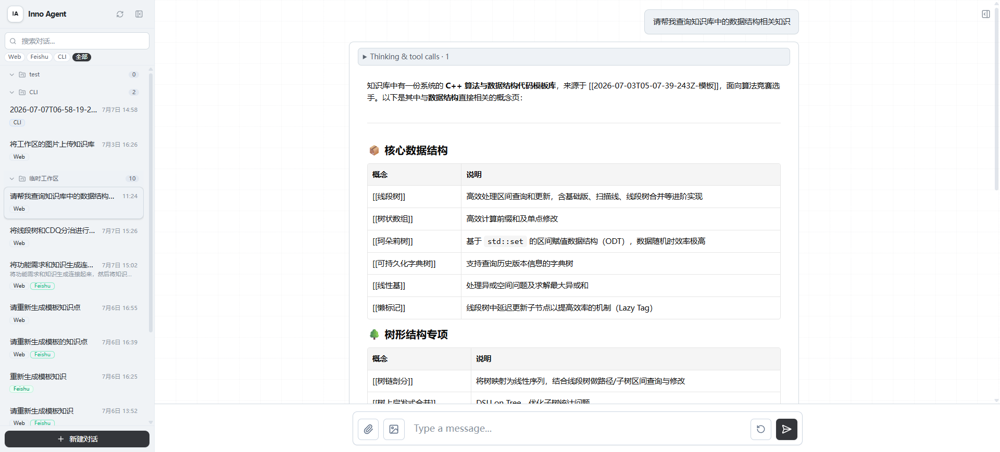

### 5.2 将对话保存为笔记

需要长期保留当前讨论时，可以直接要求 Agent 将对话保存到笔记本。系统支持保存整理后的对话原文，也支持先总结再保存；还可以指定对话范围、主题、结构、详略程度或需要提取的信息。

例如：

```text
请把以上对话整理成一篇笔记，标题为“归档功能设计讨论”，只保留结论、风险和待办事项，先不要归档。
```

```text
请把从讨论版本历史开始到现在的对话原文保存到笔记本，保留代码和链接。
```

生成的内容会作为 Markdown 草稿进入 **资料 → 草稿**，并带有 **对话记录**、**对话总结** 或 **对话原文** 标签。保存对话不会自动归档，建议先检查内容，再决定是否归档到 Wiki。

### 5.3 保存 Practice Lab 运行记录

在 Practice Lab 的 **运行历史** 中选择一条记录，点击 **归档为笔记**，可以把命令、工作目录、退出码、运行时长和输出尾部保存为 `分析` 类型的 Wiki 页面。该操作直接创建知识页面，不会先进入资料草稿区；同一条运行记录不能重复归档。

保存后可以在 **知识 → 分析** 中查找对应页面。按钮名称中的“笔记”指可长期保留的知识记录，与资料区的 Markdown 草稿不是同一种对象。

---

## 六、使用示例

下面用一个完整场景说明从资料上传、归档到 Wiki，再到对话复用知识的全过程。

### 示例：归档一份数据结构 PDF 并生成复习材料

假设你有一份名为 `模板.pdf` 的数据结构学习资料，其中包含线段树、并查集、2-SAT、网络流等内容，希望把它保存进知识库，并让 Agent 根据归档内容生成复习提纲。

#### 1. 准备资料

准备好需要归档的 PDF，例如课程讲义、论文或项目资料。

#### 2. 上传并检查文件

可以任选一种上传方式。

**方式 A：在资料视图上传**

1. 进入 **笔记本 → 资料**。
2. 点击上传按钮，选择准备好的 PDF 文件。
3. 上传完成后，在左侧草稿列表中选中该文件。
4. 在右侧预览区确认 PDF 可以正常打开，内容页没有缺失。

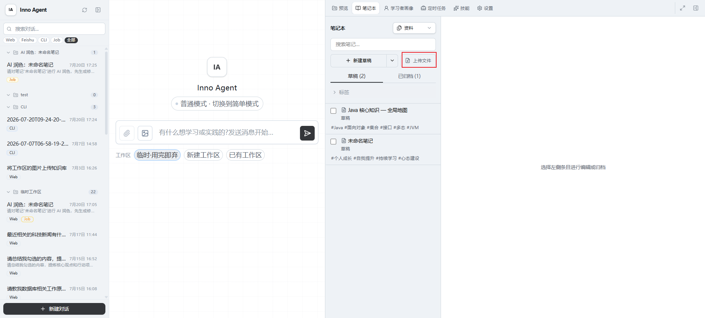

上传完成后，可以在右侧预览区检查文件内容：

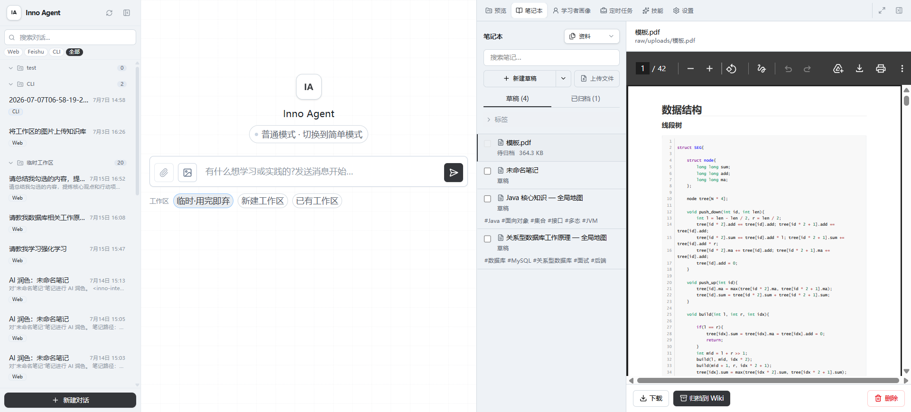

**方式 B：先上传到工作区，再让 Agent 归档**

1. 先把 PDF 上传到当前工作区，假设路径为 `uploads/模板.pdf`。
2. 回到聊天区，发送：

```text
请阅读工作区里的 uploads/模板.pdf，先总结它覆盖的数据结构与算法；如果适合长期保存，请归档到 Wiki，标题用“数据结构与算法学习资料”，标签用 数据结构、算法、竞赛学习。
```

这种方式适合你还不确定资料是否值得归档时使用。Agent 可以先分析工作区文件，再根据你的指令归档。

#### 3. 归档到 Wiki

如果使用方式 A，确认资料无误后点击 **归档到 Wiki**；如果使用方式 B，在对话中明确要求 Agent 归档该工作区文件。系统会自动完成以下处理：

1. 保存原始 PDF，保留可追溯来源。
2. 提取 PDF 中的文本内容。
3. 生成资料摘要页。
4. 识别 `2-SAT`、`线段树`、`带权并查集`、`可撤销并查集`、`网络流` 等概念。
5. 将资料摘要和概念节点加入知识图谱。

确认预览内容无误后，点击 **归档到 Wiki**：


处理完成后，资料状态会变为 **已归档**，并出现 **查看 Wiki 摘要** 入口。

#### 4. 查看生成的 Wiki 摘要

点击 **查看 Wiki 摘要** 后，会切换到 **知识** 视图。建议重点检查：

1. 摘要是否准确覆盖 PDF 中的主要数据结构与算法。
2. 关键结论是否适合后续复习。
3. 关联概念是否完整，例如 `2-SAT`、`线段树`、`并查集` 和 `网络流`。
4. 待确认事项中是否有 OCR 或解析不确定内容。

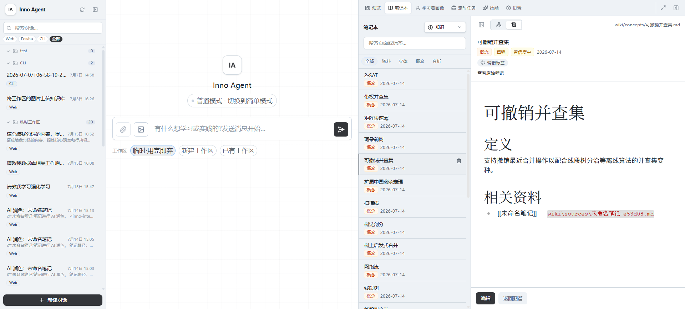

#### 5. 在图谱中查看关联

切换到 **图谱**，可以看到原始资料与各个算法概念之间的连接。单击 `可撤销并查集`、`2-SAT` 或 `线段树` 等非标签节点，可以直接打开对应 Wiki 页面。

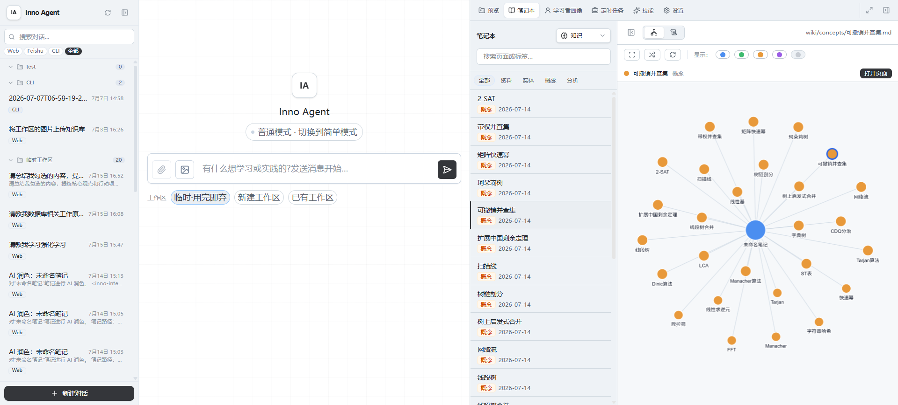

#### 6. 回到对话中复用知识

归档完成后，可以直接让 Agent 基于知识库生成复习材料：

```text
请基于刚刚归档到知识库的数据结构资料，生成一份复习提纲，分为核心算法、适用场景、复杂度、常见误区和练习题五部分，并标明来源页面。
```

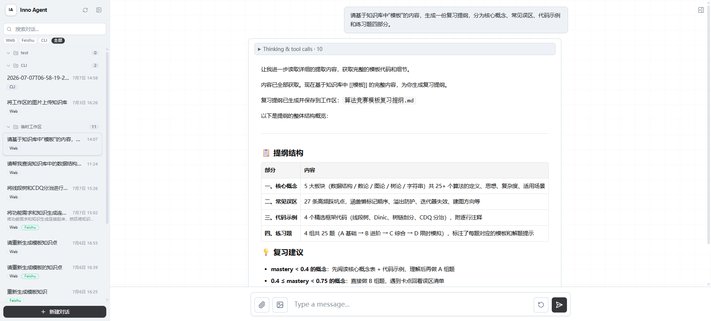

也可以继续追问：

```text
请根据这份数据结构资料出 5 道由浅入深的练习题，至少覆盖线段树和并查集，并在每题后附上参考答案。
```

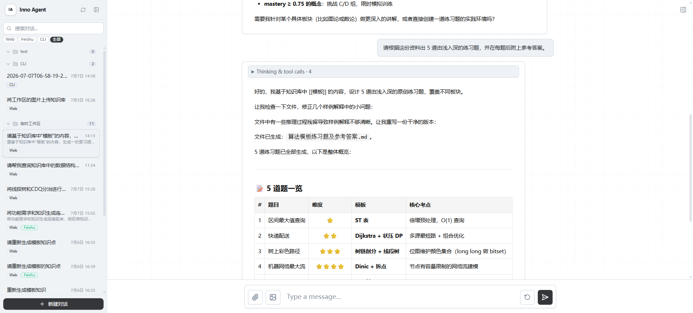

---

## 七、知识管理设置与可用性

知识管理依赖设置中的 **L2 Wiki / 知识库** 开关。关闭 L2 后，Agent 不会通过工具新建知识草稿、归档资料或查询知识库；重新开启后，原有笔记和 Wiki 数据仍然保留，不会因为关闭开关而删除。

开启 **简单模式** 时，笔记本和学习者画像会从界面隐藏，L1、L2、L3 记忆会被临时锁定为关闭。简单模式不会覆盖原来的记忆偏好；关闭简单模式后，再检查 L2 开关是否已启用。

会议录音还依赖单独的会议转写配置、有效的服务凭证和麦克风权限；导入音频需要运行环境能够执行 FFmpeg。

---

## 八、常见问题

**Q：草稿会进入知识图谱吗？**

不会。草稿只保存在资料列表中，点击 **归档到 Wiki** 后才会进入 Wiki 和图谱。

**Q：如何创建自己的笔记模板？**

进入 **笔记本 → 资料**，点击 **新建草稿** 右侧的下拉按钮，再选择 **新建自定义模板**。填写名称、描述、默认标签和 Markdown 正文后点击 **创建**；模板 ID、英文名称和笔记初始标题都由系统自动处理。

**Q：为什么不能修改内置模板？**

内置模板随应用发布，为避免升级时产生冲突，只允许查看。点击 **复制为自定义模板** 后，可以修改复制得到的个人模板。

**Q：为什么自定义模板没有出现在创建菜单或 AI 润色中？**

打开 **管理模板**，确认模板已经成功保存且正文不为空。自定义模板保存后会自动出现在创建菜单中，并参与 AI 模板匹配；必要时刷新页面后重试。

**Q：返回资料时为什么提示有未保存修改？**

只有名称、描述、标签或 Markdown 正文发生真实变化时才会提示。需要保留修改时点击 **继续编辑** 并保存；不需要时确认放弃。如果只是打开模板查看，正常情况下不会提示。

**Q：AI 润色一定会使用自定义模板吗？**

不一定。AI 会在可见模板中判断内容是否明确匹配；没有合适模板时会使用通用结构。需要指定模板时，请在对话中明确写出模板名称。

**Q：归档后还能修改吗？**

可以。修改已归档笔记后，资料会变为 **待更新**。点击 **重新归档** 后，Wiki 摘要和图谱关系会同步更新。

**Q：恢复历史版本会覆盖当前内容吗？**

恢复后，所选历史版本会成为笔记的当前内容，但系统会先把恢复前的内容保留为一个版本，因此仍可再次找回。已归档笔记可以直接恢复；恢复后资料会变为 **待更新**，检查完成后重新归档即可更新 Wiki。

**Q：为什么版本历史里没有每一次输入？**

版本历史记录的是创建、自动保存、手动保存和版本恢复产生的快照，不是逐字编辑日志。内容没有变化时不会新增版本，短时间内连续产生的自动保存也会合并。每篇笔记最多保留最近 100 个版本。

**Q：如何对多篇笔记做总结或对比？**

在 **笔记本 → 资料** 中勾选每篇资料左侧的复选框，再点击列表底部的 **在对话中总结**。确认聊天输入框上方显示了全部目标笔记后，输入总结、对比、提炼或重组要求并发送。一次最多选择 20 篇。

**Q：多篇笔记的加工结果会覆盖原笔记吗？**

不会。结果默认只出现在当前对话中，原笔记保持不变。需要保存时，应明确要求 Agent 把结果创建为一篇新笔记；检查无误后，再决定是否归档到 Wiki。

**Q：为什么有些文件不能勾选为 AI 引用？**

Markdown 笔记可以直接引用；PDF、Word、图片等文件必须先完成正文提取。复选框禁用时，请先归档或完成提取，再重新选择。

**Q：撤回归档会删除原始资料吗？**

不会。撤回归档会移除生成的 Wiki 摘要和仅由它提取的知识点，原始内容会回到草稿箱。

**Q：上传文件失败怎么办？**

先确认文件是否能正常打开，文件名是否包含特殊字符，文件体积是否过大。必要时可将内容转成 Markdown、PDF 或图片后重新上传。

**Q：为什么空笔记不能归档？**

笔记至少需要非空正文或一个可解析附件。正文和附件都为空时，系统会禁用归档按钮。

**Q：为什么添加附件后仍然归档失败？**

归档会解析全部附件；任一附件格式不受支持、内容为空或解析失败，都会中止本次归档。根据错误提示修复、转换或删除对应附件后再重试。

**Q：停止归档后会留下不完整的 Wiki 页面吗？**

原始资料始终保留。停止后请刷新资料和图谱确认状态；如果部分生成结果已经可见，可以重新归档以完成同步，或先撤回归档再重新处理。

**Q：图谱里没有内容怎么办？**

先确认至少有一条资料已经成功 **归档到 Wiki**。如果刚刚归档完成，可以点击图谱中的 **刷新图谱**。

**Q：标签应该怎么写？**

建议使用稳定、短小、可复用的标签，例如课程名、项目名、技术栈、主题词。避免同一类内容同时出现 `React`、`reactjs`、`React.js` 这类重复标签。

**Q：看不到“笔记本”入口怎么办？**

检查是否开启了 **简单模式**。简单模式会隐藏笔记本和学习者画像，并暂时关闭 L1/L2/L3 记忆。关闭简单模式后，再确认设置中的 L2 记忆已启用。

**Q：Agent 没有使用知识库内容怎么办？**

在指令中明确写“查询 L2 Wiki / 知识库”，提供主题关键词，并要求列出来源。如果仍无结果，先在知识区搜索，确认相关页面确实存在。

**Q：导入会议音频失败怎么办？**

确认文件格式受支持、文件未损坏、FFmpeg 可执行，并检查会议转写服务配置。修复配置后可以重新导入或使用 **重新转写**。

**Q：为什么麦克风按钮不可用？**

请先在资料区选中一篇 Markdown 笔记，并确认没有其他录音正在连接、录制、暂停或生成纪要；同时检查会议转写配置和浏览器麦克风权限。

**Q：实时录音会创建新笔记吗？**

不会。实时录音会追加到当前笔记的 **录音记录** 章节。只有通过上传按钮导入已有音频时，系统才会新建一篇会议纪要草稿。

**Q：删除正在录音的笔记会怎样？**

录音会立即停止，并被标记为中断。删除草稿属于永久操作，正文、附件和版本历史也会一并删除。

**Q：是否可以直接编辑 Wiki 页面？**

可以。小范围修正可以直接编辑 Wiki；如果原始资料发生变化，应回到资料区修改并重新归档。
