# Inno Agent 知识管理使用说明

本文介绍如何使用 Inno Agent 的知识管理部分，将学习资料、个人笔记和对话结论沉淀到 L2 Wiki 知识库，并通过知识图谱进行浏览、检索和复用。

---

## 一、功能入口

打开 Inno Agent Web UI 后，在右侧工作区面板中进入 **笔记本** 标签页。知识管理区域顶部包含两个视图：

| 视图 | 页面名称 | 主要用途 |
|---|---|---|
| 资料 | 资料 / 草稿 / 已归档 | 上传文件、新建笔记、编辑草稿、归档到 Wiki |
| 知识 | Wiki / 图谱 / 页面 | 浏览已归档知识、查看图谱、按类型搜索和筛选 |

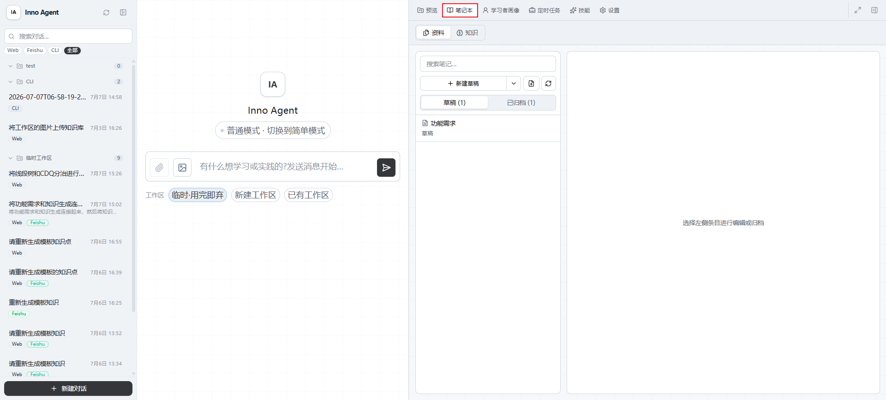

---

## 二、资料视图：管理待归档内容

**资料** 视图用于收集和整理原始材料。这里的内容可以是手写 Markdown 笔记，也可以是上传的 PDF、图片、Word、文本等文件。

### 2.1 新建草稿

1. 进入 **笔记本 → 资料**。
2. 点击左侧工具栏中的 **新建草稿**。
3. 在右侧编辑区填写标题、标签和正文。
4. 点击 **保存**，草稿会保留在 **草稿** 列表中。

草稿只是原始资料，不会自动进入知识图谱。只有点击 **归档到 Wiki** 后，系统才会生成 Wiki 摘要和关联概念。

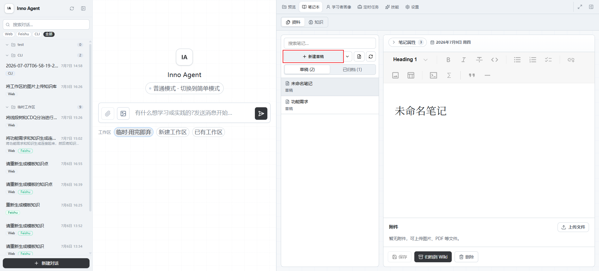

### 2.2 从模板创建笔记

在 **新建草稿** 右侧点击下拉按钮，可以从模板创建笔记。适合会议纪要、读书笔记、学习复盘等有固定结构的内容。

建议填写：

- 标题：让后续搜索时能快速识别主题。
- 标签：用于分类和图谱联动，例如 `React`、`论文阅读`、`项目复盘`。
- 记录日期：用于保留资料发生或记录的时间。
- 正文：尽量写清楚背景、结论、疑问和待办。

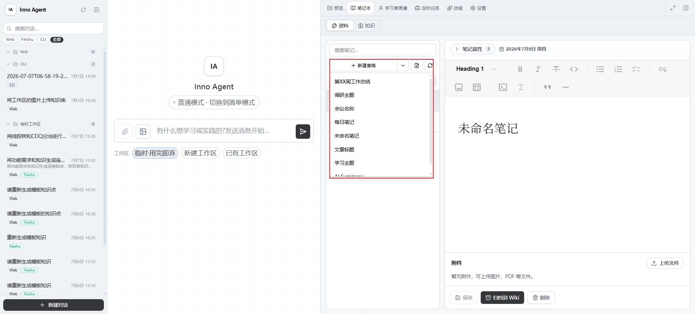

### 2.3 上传文件

文件可以通过两种方式进入知识管理流程：在 **资料** 视图中手动上传，或先上传到工作区后通过 AI 交互归档。

#### 方式 A：在资料视图上传

1. 在 **资料** 视图左侧点击上传按钮。
2. 选择需要上传的文件。
3. 上传后文件会出现在 **草稿** 列表中，状态通常为 **待归档** 或 **已提取**。
4. 在右侧预览文件内容，确认无误后点击 **归档到 Wiki**。

PDF 和图片会在右侧预览区显示原文件；文本类文件会显示可阅读内容。对于无法直接预览的二进制文件，可以先下载查看，再决定是否归档。

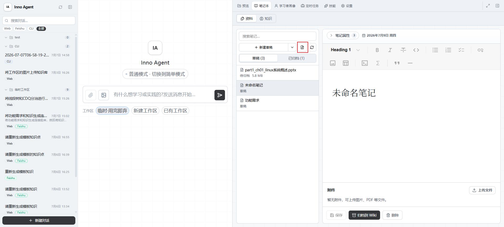

#### 方式 B：通过 AI 交互归档工作区文件

也可以先把文件上传到工作区，再通过对话要求 Agent 读取并归档。适合边讨论、边分析、边决定是否进入知识库的场景。

操作步骤：

1. 在右侧 **工作区** 面板中上传文件，或把文件拖入当前工作区。
2. 确认文件已经出现在工作区文件列表中，例如 `uploads/react-hooks-closure.pdf`。
3. 回到聊天区，用自然语言告诉 Agent 要处理哪个文件。
4. 要求 Agent 先分析文件内容，再按你的标题和标签归档到 Wiki。

示例指令：

```text
我已经把 XXXX PDF 上传到工作区。请先总结主要内容，再把它归档到 Wiki。
```

通过这种方式，文件先作为工作区资料存在；当你明确要求归档时，Agent 会读取该文件，将内容整理为 Wiki 摘要，并生成相应的概念和图谱关联。


---

## 三、归档到 Wiki

点击 **归档到 Wiki** 后，Inno Agent 会把当前资料转换为可长期复用的知识：

1. 保存原始资料，作为可追溯来源。
2. 提取正文或文件内容。
3. 生成一篇资料摘要页。
4. 自动识别相关概念、实体、分析主题和标签。
5. 将页面和关联关系加入知识图谱。

归档完成后，资料会移动到 **已归档** 列表，并出现 **查看 Wiki 摘要** 按钮。点击后会切换到 **知识** 视图，打开对应的 Wiki 页面。

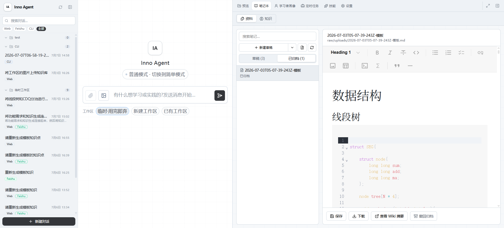

### 归档后的状态

| 状态 | 含义 | 建议操作 |
|---|---|---|
| 已归档 | 内容已进入 Wiki 和知识图谱 | 可直接查看或继续提问 |
| 待更新 | 原始笔记已修改，但 Wiki 摘要还未同步 | 点击 **重新归档** |
| 失败 | 上传、解析或生成失败 | 检查文件内容后重试 |

---

## 四、知识视图：浏览 Wiki 和图谱

切换到 **知识** 视图后，可以查看已经沉淀到 L2 Wiki 的知识页面。左侧是页面列表和筛选区，右侧是图谱或页面内容。

### 4.1 搜索和筛选

左侧搜索框支持按页面标题、路径或标签搜索。类型筛选包括：

| 类型 | 含义 |
|---|---|
| 资料 | 由文件、笔记或对话归档生成的主摘要页 |
| 实体 | 人物、组织、项目、产品、技术名词等实体 |
| 概念 | 可复用的知识点、方法、定义或原理 |
| 分析 | 由资料延展出的判断、比较或总结 |

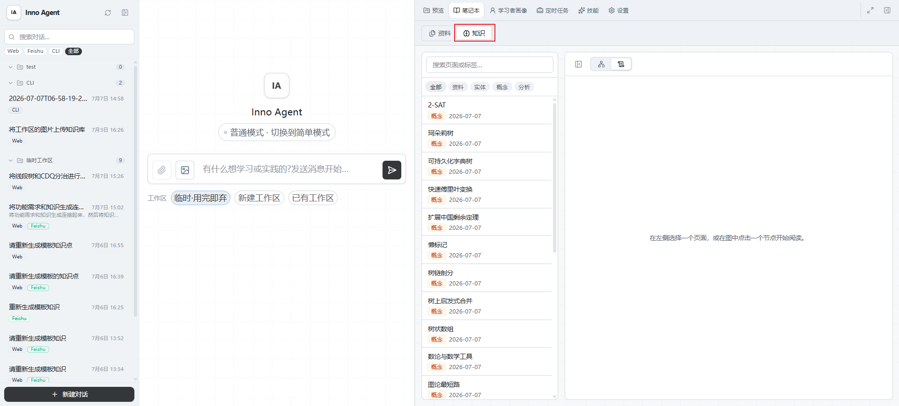

### 4.2 图谱视图

点击 **图谱** 可以查看知识之间的连接关系。图谱中的节点代表资料、概念、实体、分析或标签，边代表页面之间的引用和关联。

常用操作：

1. 点击节点：查看节点详情。
2. 双击非标签节点：打开对应 Wiki 页面。
3. 点击 **自适应**：让图谱自动缩放到合适范围。
4. 点击 **居中**：回到当前图谱中心。
5. 打开或关闭 **标签**：控制节点文字显示。
6. 调整 **节点大小**：让复杂图谱更容易阅读。

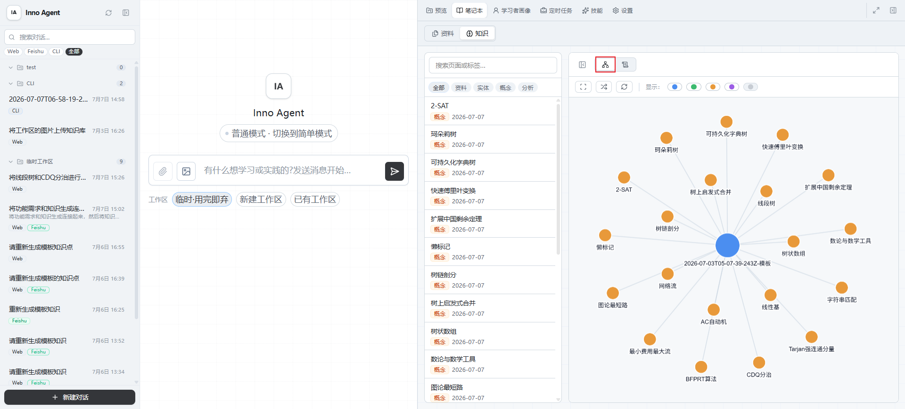

### 4.3 页面视图

点击 **页面** 可以阅读当前选中的 Wiki 页面。资料摘要页通常包含：

- 概览：这份资料讲了什么。
- 关键结论：值得长期保留的结论。
- 推导过程：重要背景、判断依据和取舍。
- 关联概念 / 实体：可进入图谱继续浏览的知识节点。
- 来源：指向原始笔记、文件或对话归档。
- 待确认事项：不确定、需复核或 OCR 可能有误的内容。

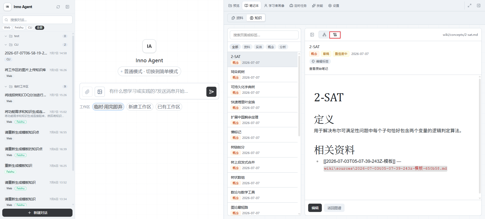

---

## 五、在对话中复用知识

归档后的知识可以在后续对话中被 Agent 检索和引用。你可以直接在聊天中提出类似问题：

```text
帮我查一下知识库里关于 React Hooks 闭包陷阱的内容，并总结成 5 条复习要点。
```


---

## 六、使用示例

下面用一个完整场景说明从资料上传、归档到 Wiki，再到对话复用知识的全过程。

### 示例：归档一篇课程 PDF 并生成复习材料

假设你刚拿到一份课程 PDF，主题是 `React Hooks 闭包陷阱`，希望把它保存进知识库，并让 Agent 根据归档内容生成复习提纲。

#### 1. 准备资料

准备好需要归档的 PDF，例如课程讲义、论文或项目资料。

#### 2. 上传并检查文件

可以任选一种上传方式。

**方式 A：在资料视图上传**

1. 进入 **笔记本 → 资料**。
2. 点击上传按钮，选择准备好的 PDF 文件。
3. 上传完成后，在左侧草稿列表中选中该文件。
4. 在右侧预览区确认 PDF 可以正常打开，内容页没有缺失。

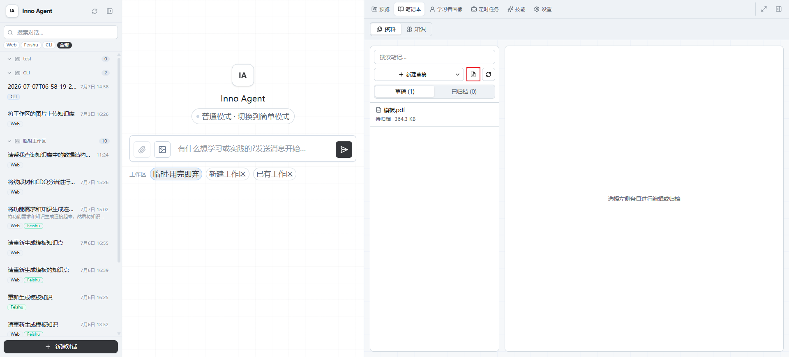

**方式 B：先上传到工作区，再让 Agent 归档**

1. 先把 PDF 上传到当前工作区，假设路径为 `uploads/react-hooks-closure.pdf`。
2. 回到聊天区，发送：

```text
请阅读工作区里的 uploads/react-hooks-closure.pdf，先总结它讲了什么；如果适合长期保存，请归档到 Wiki，标题用“React Hooks 闭包陷阱课程笔记”，标签用 React、Hooks、前端学习。
```

这种方式适合你还不确定资料是否值得归档时使用。Agent 可以先分析工作区文件，再根据你的指令归档。

#### 3. 归档到 Wiki

如果使用方式 A，确认资料无误后点击 **归档到 Wiki**；如果使用方式 B，在对话中明确要求 Agent 归档该工作区文件。系统会自动完成以下处理：

1. 保存原始 PDF，保留可追溯来源。
2. 提取 PDF 中的文本内容。
3. 生成资料摘要页。
4. 识别 `React`、`Hooks`、`闭包`、`useEffect` 等概念。
5. 将资料摘要和概念节点加入知识图谱。

归档成功后，资料状态会变为 **已归档**，并出现 **查看 Wiki 摘要** 入口。


#### 4. 查看生成的 Wiki 摘要

点击 **查看 Wiki 摘要** 后，会切换到 **知识** 视图。建议重点检查：

1. 摘要是否准确覆盖课程主要内容。
2. 关键结论是否适合后续复习。
3. 关联概念是否完整，例如 `useEffect`、`依赖数组`、`闭包陷阱`。
4. 待确认事项中是否有 OCR 或解析不确定内容。

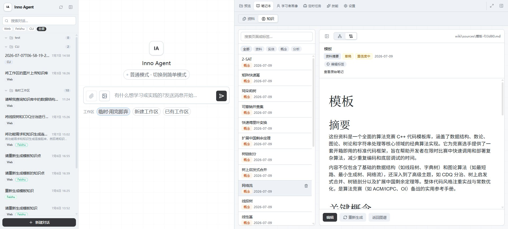

#### 5. 在图谱中查看关联

切换到 **图谱**，可以看到这份资料与相关概念之间的连接。点击 `React Hooks 闭包陷阱` 或 `useEffect` 节点，可以查看节点详情；双击节点可以打开对应 Wiki 页面。

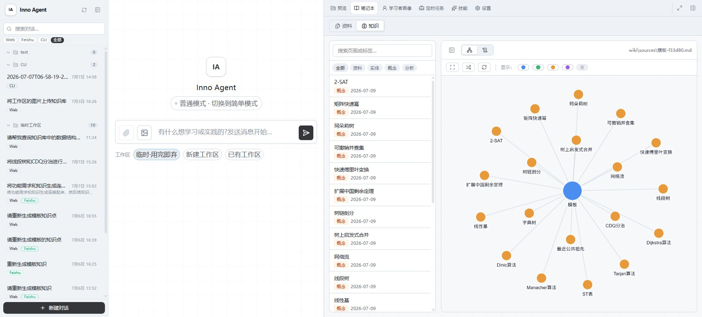

#### 6. 回到对话中复用知识

归档完成后，可以直接让 Agent 基于知识库生成复习材料：

```text
请基于刚刚归档到知识库的课程资料，生成一份复习提纲，分为核心概念、常见误区、代码示例和练习题四部分。
```


也可以继续追问：

```text
请根据这份资料出 5 道由浅入深的练习题，并在每题后附上参考答案。
```


---

## 七、常见问题

**Q：草稿会进入知识图谱吗？**

不会。草稿只保存在资料列表中，点击 **归档到 Wiki** 后才会进入 Wiki 和图谱。

**Q：归档后还能修改吗？**

可以。修改已归档笔记后，资料会变为 **待更新**。点击 **重新归档** 后，Wiki 摘要和图谱关系会同步更新。

**Q：撤回归档会删除原始资料吗？**

不会。撤回归档会移除生成的 Wiki 摘要和仅由它提取的知识点，原始内容会回到草稿箱。

**Q：上传文件失败怎么办？**

先确认文件是否能正常打开，文件名是否包含特殊字符，文件体积是否过大。必要时可将内容转成 Markdown、PDF 或图片后重新上传。

**Q：图谱里没有内容怎么办？**

先确认至少有一条资料已经成功 **归档到 Wiki**。如果刚刚归档完成，可以点击图谱中的 **刷新图谱**。

**Q：标签应该怎么写？**

建议使用稳定、短小、可复用的标签，例如课程名、项目名、技术栈、主题词。避免同一类内容同时出现 `React`、`reactjs`、`React.js` 这类重复标签。
